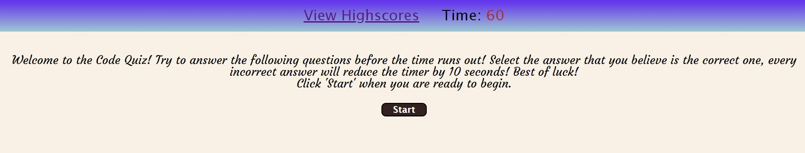
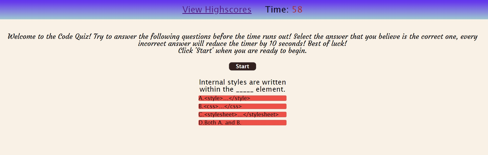
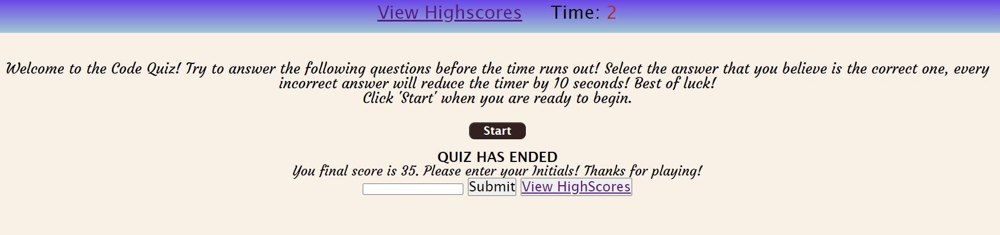
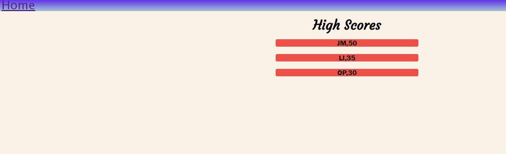

# Module 4 Challenge - Code Quiz

## Description

Created a code quiz to be used by bootcamp students to test their knowledge. Bootcamp students who choose to take this quiz will have 60 seconds to answer the questions that appear on-screen. Every correct answer will reward the student with 5 points. However, every incorrect answer will cause the time left to be reduced by 10 seconds. After the game is over, players will then be able to save their initials along with their score which will be displayed on the high scores page. 

Published website:  https://molyneauxk93.github.io/KevinMolyneaux-Module4-Code-Quiz/

## Installation

N/A

## Usage

Visit Kevin Molyneaux's code quiz to challenge yourself and test the knowledge you have acquired thus far in this bootcamp.

## Credits

Credit to the following stack overflow thread for helping me with the comparison line of my highscores sort: 

<a href="https://stackoverflow.com/questions/11499268/sort-two-arrays-the-same-way">Sort Two Arays the Same Way</a>

## License

MIT License - Please refer to the LICENSE in the repo.

## Usage
The following image shows the initial page that has a header containing a link to the High Scores page as well as the Time counter. Below this is the welcome message and the 'start' button to begin the quiz when clicked:

The follwing image shows the question section being rendered to the screen with one of the stored questions:

The following image shows the Initials submit section that appears once all questions are answered OR the timer has run out: 

The following image shows the High Scores page with some initials and scores listed: 

